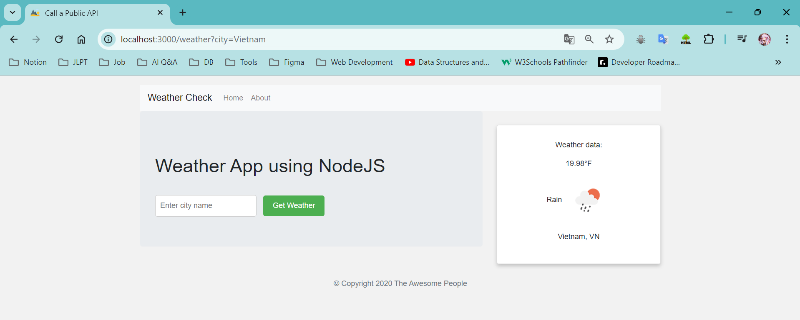

<!-- Improved compatibility of back to top link: See: https://github.com/othneildrew/Best-README-Template/pull/73 -->
<a id="readme-top"></a>
<!--
*** Thanks for checking out the Best-README-Template. If you have a suggestion
*** that would make this better, please fork the repo and create a pull request
*** or simply open an issue with the tag "enhancement".
*** Don't forget to give the project a star!
*** Thanks again! Now go create something AMAZING! :D
-->


<!-- ABOUT THE PROJECT -->
## About The Project

Using NodeJS || Express || Axios || EJS to create a server call API public weather.
<a href="https://openweathermap.org/current#builtin" alt="Remember to login take the API key">Link OpenWeather</a>

<p align="right">(<a href="#readme-top">back to top</a>)</p>


### Built With

This section should list any major frameworks/libraries used to bootstrap your project. Leave any add-ons/plugins for the acknowledgements section. Here are a few examples.

* [[Nodejs-url](https://nodejs.org/)]
* [[EJS-url](https://ejs.co/)]
* [[Express-url](https://expressjs.com/)]
* [[Axios-url](https://axios-http.com/)]

* Demo:
  

<p align="right">(<a href="#readme-top">back to top</a>)</p>


<!-- GETTING STARTED -->
## Getting Started

After cloning project do this to load the web server

* npm
  ```sh
  npm install npm@latest -g
  ```

### Installation

1. Get a free API Key at [https://openweathermap.org/](https://openweathermap.org/)
2. Clone the repo
   ```sh
   git clone https://github.com/TRKUyen/Use_Public_API_NodeJS.git
   ```
3. Install NPM packages
   ```sh
   npm install
   ```
4. Enter your API in `server.js`
   ```js
   const API_KEY = 'ENTER YOUR API';
   ```
5. Run localhost:3000 in `server.js` open with terminal
   ```js
   nodemon server.js
   ```

<p align="right">(<a href="#readme-top">back to top</a>)</p>

<!-- CONTRIBUTING -->
## Contributing

Contributions are what make the open source community such an amazing place to learn, inspire, and create. Any contributions you make are **greatly appreciated**.

If you have a suggestion that would make this better, please fork the repo and create a pull request. You can also simply open an issue with the tag "enhancement".
Don't forget to give the project a star! Thanks again!

1. Fork the Project
2. Create your Feature Branch (`git checkout -b feature/AmazingFeature`)
3. Commit your Changes (`git commit -m 'Add some AmazingFeature'`)
4. Push to the Branch (`git push origin feature/AmazingFeature`)
5. Open a Pull Request

<p align="right">(<a href="#readme-top">back to top</a>)</p>


